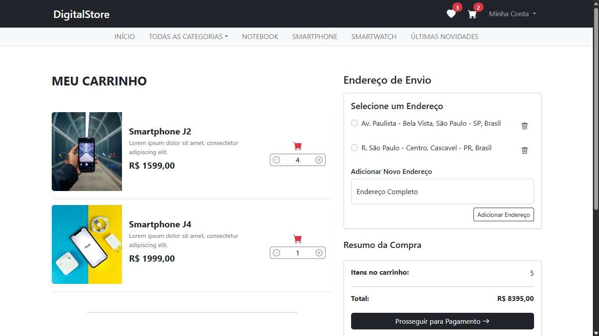

# 🌍 Digital Store 



👉 [🔗 Ver projeto em produção][https://digital-store-gwgzd5f9gpesavab.brazilsouth-01.azurewebsites.net/]

Digital Store é uma plataforma de e-commerce com dois tipos de perfis: administrador e cliente.

- O administrador pode personalizar o site (nome, banner e frase de destaque), além de gerenciar
produtos e pedidos, tornando a plataforma adaptável a qualquer segmento.

- O cliente tem acesso a funcionalidades como carrinho de compras, produtos favoritados,
histórico de pedidos e sistema de pagamentos.

A interface é simples e objetiva, com foco em usabilidade. O sistema conta com recursos de segurança
e controle de acesso para garantir uma navegação segura e confiável.

## Principais Funcionalidades

📦 CRUD Completo para Produtos e Pedidos: Gerenciamento de produtos com nome, descrição, preço, imagem e categoria. Controle total dos pedidos realizados na plataforma.

🖥️ Personalização da Loja (Admin): O administrador pode editar o nome do site, banner e frase de destaque, tornando a loja flexível para qualquer nicho.

🔐 Sistema de Login Seguro: Autenticação baseada em cookies, com verificação de identidade e proteção contra acessos não autorizados.

👥 Gerenciamento de Usuário (Cliente e Admin): Separação de permissões e funcionalidades por perfil, com controle de acesso via filtros de autorização.

🛒 Carrinho de Compras (Cliente): Adição, remoção e edição de produtos no carrinho, com cálculo automático do total.

❤️ Favoritos (Cliente): Possibilidade de favoritar produtos para consulta futura.

📜 Histórico de Pedidos (Cliente): Visualização de pedidos anteriores com detalhes completos.

💳 Pagamentos com Stripe: Integração com Stripe para pagamentos com cartão de crédito de forma segura.

📍 Endereço com Google Maps API: Autocompletar de endereço via API do Google, facilitando o cadastro de endereços.

📧 Redefinição de Senha via Email (SMTP): Envio de nova senha ao email cadastrado em caso de esquecimento.

🔒 Alteração de Senha Segura: Troca de senha com verificação da senha atual e validação de segurança.

🛡️ Segurança Avançada: Proteção contra SQL Injection, XSS, validações no Razor e uso seguro do Entity Framework.

⚙️ Entity Framework Core ORM: Migrations automáticas com SQL Server.

🔑 Criptografia de Senhas: Armazenamento das senhas criptografadas utilizando SHA-1.

🍪 Sessão de Usuário com Cookies: Armazenamento seguro da sessão para manter autenticação durante toda a navegação.

📊 Logs de Atividade com Serilog: Registro de ações dos usuários para monitoramento e auditoria do sistema.


## Tecnologias Usadas

### **Back-End**
 |  |  | 

### **Front-End**
 |  |  |  | 

### Integrações e Serviços

💳 Stripe API – Processamento de pagamentos com cartão de crédito de forma segura.

📧 SMTP – Envio de emails para redefinição de senha e newsletter.

📝 Serilog – Registro de logs e atividades para monitoramento e auditoria do sistema.

🔹 Google Maps JavaScript API - Carrega os recursos principais usados no front-end, como Autocomplete.

🔹 Google Places API (Autocomplete) - Utilizada para fornecer sugestões de cidades durante o cadastro de endereços.

## Instalação

### ✅ Pré-requisitos

Antes de rodar o projeto, você precisa ter:

- [Visual Studio 2022+](https://visualstudio.microsoft.com/) com suporte para **ASP.NET Core** e **.NET 8.0**
- [.NET SDK 8.0](https://dotnet.microsoft.com/en-us/download/dotnet/8.0)
- [SQL Server](https://www.microsoft.com/en-us/sql-server/sql-server-downloads) instalado e rodando localmente
- [Conta no Stripe](https://stripe.com) – Para ativar e testar pagamentos com cartão
- [Conta no Google Cloud](https://cloud.google.com) – Para integração com APIs do Google
- Compatível com: **Windows**, **macOS** e **Linux**

### 🧩 Passo a passo

#### 1️⃣ Clone o repositório

```bash
git clone https://github.com/alicemarquesdev/DigitalStore.git
```

#### 2️⃣ Restaure os pacotes NuGet

```bash
dotnet restore
```

Pacotes NuGet utilizados:

- Microsoft.EntityFrameworkCore (9.0.3)
- Microsoft.EntityFrameworkCore.Design (9.0.3)
- Microsoft.EntityFrameworkCore.SqlServer (9.0.3)
- Microsoft.EntityFrameworkCore.Tools (9.0.3)
- Newtonsoft.Json (13.0.3)
- Serilog.AspNetCore (9.0.0)
- Serilog.Sinks.Console (6.0.0)
- Serilog.Sinks.File (6.0.0)
- SixLabors.ImageSharp (3.1.7)
- Stripe.net (47.3.0)

#### 3️⃣ Configure o appsettings.json

Crie ou edite o arquivo appsettings.json com suas informações de conexão e SMTP:

```bash
{
  "Logging": {
    "LogLevel": {
      "Default": "Information",
      "Microsoft.AspNetCore": "Warning"
    }
  },
  "Serilog": {
    "Using": [ "Serilog.Sinks.File" ],
    "MinimumLevel": "Information",
    "WriteTo": [
      {
        "Name": "File",
        "Args": {
          "Path": "logs/app.log",
          "RollingInterval": "Day",
          "RetainedFileCountLimit": 7,
          "FileSizeLimitBytes": 10485760,
          "Buffered": true
        }
      }
    ]
  },
"ConnectionStrings": {
    "DataBase": "Server=localhost;Database=NomeDoBanco;Trusted_Connection=True;MultipleActiveResultSets=true;TrustServerCertificate=True"
},
  "EmailSettings": {
    "SmtpServer": "smtp.gmail.com",
    "SmtpPort": 587,
    "SenderEmail": "seuemail@dominio.com",
    "SenderPassword": "suasenha"
 },
  "GoogleAPISettings": {
    "ApiKey": "SuaAPIKey"
  },

  "StripeSettings": {
    "SecretKey": "SuaChaveSecreta", // Sua chave secreta
    "PublishableKey": "SuaChavePublica" // Sua chave pública
  },

  "AllowedHosts": "*"
}
```

#### 4️⃣ Aplicar as Migrations

Aplicar as migrations para criar o esquema do banco de dados:

```bash
dotnet ef migrations add InitialCreate
dotnet ef database update
```

#### 5️⃣ Execute o projeto

No Visual Studio, clique em Iniciar (F5) ou use: 
```bash
dotnet run
```

#### 6️⃣ Acesse no navegador

O projeto estará disponível em:
```bash
http://localhost:5001
```
Ou a porta definida no launchSettings.json.

## Licença

Este projeto está licenciado sob a Licença MIT. Veja o arquivo [LICENSE.txt](LICENSE.txt) para mais detalhes.

## Contato

🔗[**LinkedIn**](https://linkedin.com/in/alicemarquesdev)  |
 📧 [**E-mail**](mailto:alicemarques.dev@hotmail.com)  |
🌐 [**Portfólio**](https://alicemarquesdev.github.io/portfolio-AM/) 


