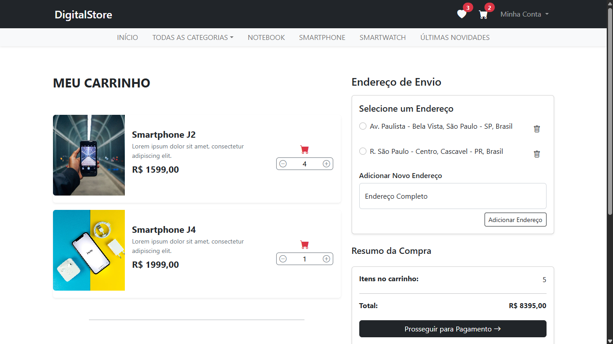

# 🌍 Digital Store
 [Veja a aplicação em ação](mailto:alicemarques.dev@hotmail.com)



Digital Store é uma plataforma de e-commerce com dois tipos de perfis: administrador e cliente.

- O administrador pode personalizar o site (nome, banner e frase de destaque), além de gerenciar
produtos e pedidos, tornando a plataforma adaptável a qualquer segmento.

- O cliente tem acesso a funcionalidades como carrinho de compras, produtos favoritados,
histórico de pedidos e sistema de pagamentos.

A interface é simples e objetiva, com foco em usabilidade. O sistema conta com recursos de segurança
e controle de acesso para garantir uma navegação segura e confiável.

## Principais Funcionalidades

- **CRUD Completo para Produtos e Pedidos**: Gerenciamento de produtos com nome, descrição, preço, imagem e categoria. Controle total dos pedidos realizados na plataforma.
- **Personalização da Loja (Admin)**: O administrador pode editar o nome do site, banner e frase de destaque, tornando a loja flexível para qualquer nicho.
- **Sistema de Login Seguro**: Autenticação baseada em cookies, com verificação de identidade e proteção contra acessos não autorizados.
- **Gerenciamento de Usuário (Cliente e Admin)**: Separação de permissões e funcionalidades por perfil, com controle de acesso via filtros de autorização.
- **Carrinho de Compras (Cliente)**: Adição, remoção e edição de produtos no carrinho, com cálculo automático do total.
- **Favoritos (Cliente)**: Possibilidade de favoritar produtos para consulta futura.
- **Histórico de Pedidos (Cliente)**: Visualização de pedidos anteriores com detalhes completos.
- **Pagamentos com Stripe**: Integração com Stripe para pagamentos com cartão de crédito de forma segura.
- **Endereço com Google Maps API**: Autocompletar de endereço via API do Google, facilitando o cadastro de endereços.
- **Redefinição de Senha via Email (SMTP)**: Envio de nova senha ao email cadastrado em caso de esquecimento.
- **Alteração de Senha Segura**: Troca de senha com verificação da senha atual e validação de segurança.
- **Segurança Avançada**: Proteção contra SQL Injection, XSS, validações no Razor e uso seguro do Entity Framework.
- **Entity Framework Core ORM**: Migrations automáticas com SQL Server.
- **Criptografia de Senhas**: Armazenamento das senhas criptografadas utilizando SHA-1.
- **Sessão de Usuário com Cookies**: Armazenamento seguro da sessão para manter autenticação durante toda a navegação.
- **Logs de Atividade com Serilog**: Registro de ações dos usuários para monitoramento e auditoria do sistema.

## Tecnologias Usadas

### **Back-End**
C# | ASP.NET Core MVC | Entity Framework Core | SQL Server

### **Front-End**
HTML | CSS | Bootstrap | jQuery | JavaScript

### Integrações e Serviços
- **Stripe API** – Processamento de pagamentos
- **Google Maps API** – Autocomplete de endereço no cadastro
- **SMTP** – Envio de emails para redefinição de senha e newsletter
- **Serilog** – Registro de logs e atividades

## Instalação

### **Pré-Requisitos**

Antes de rodar o projeto, é necessário ter as seguintes ferramentas instaladas:

- **Visual Studio 2022 ou superior** com o suporte para **ASP.NET Core e .NET 8.0**.
- **.NET SDK 8.0** (necessário para compilar o projeto).
- **SQL Server** (necessário para o banco de dados relacional).
- Compátivel com **Windows** | **macOS** | **Linux**.
- Conta no Stripe – Para ativar e testar pagamentos com cartão
- Conta no Google Cloud – Para Integração com APIs do Google

### **Passo a Passo para Executar o Projeto Localmente**

1. **Clonar o Repositório**  
   Primeiro, você precisa clonar o repositório do projeto para sua máquina local. Utilize o Git para isso:

```bash
git clone https://github.com/alicemarquesdev/DigitalStore.git
```

2. **Instalar as Dependências do Projeto**

Execute o comando abaixo para restaurar pacotes NuGet

```bash
dotnet restore
```

- Microsoft.AspNetCore.Mvc.Razor.RuntimeCompilation (8.0.8) | Microsoft.EntityFrameworkCore (8.0.8) | Microsoft.EntityFrameworkCore.Design (8.0.8) |
Microsoft.EntityFrameworkCore.SqlServer (8.0.8) | Microsoft.EntityFrameworkCore.Tools (8.0.8) | Newtonsoft.Json (13.0.3) |
Serilog (4.2.0) | Serilog.AspNetCore (9.0.0) | Serilog.Sinks.Console (6.0.0) | Serilog.Sinks.File (6.0.0) |
SixLabors.ImageSharp (3.1.7) | Stripe.net (47.3.0)

3. **Configuração appsettings**
Verifique se você possui um arquivo appsettings.json com as configurações corretas para o banco de dados e outras variáveis.
Certifique-se de ter o SQL Server instalado e configurado. Crie um banco de dados para o projeto e configure a string de conexão no arquivo.
Configure também as credenciais SMTP.
Exemplo de configuração:

```bash
{
  "Logging": {
    "LogLevel": {
      "Default": "Information",
      "Microsoft.AspNetCore": "Warning"
    }
  },
  "Serilog": {
    "Using": [ "Serilog.Sinks.File" ],
    "MinimumLevel": "Information",
    "WriteTo": [
      {
        "Name": "File",
        "Args": {
          "Path": "logs/app.log",
          "RollingInterval": "Day",
          "RetainedFileCountLimit": 7,
          "FileSizeLimitBytes": 10485760,
          "Buffered": true
        }
      }
    ]
  },
"ConnectionStrings": {
    "DataBase": "Server=localhost;Database=NomeDoBanco;Trusted_Connection=True;MultipleActiveResultSets=true;TrustServerCertificate=True"
},
  "EmailSettings": {
    "SmtpServer": "smtp.gmail.com", // utilizando gmail
    "SmtpPort": 587,
    "SenderEmail": "seuemail@dominio.com",
    "SenderPassword": "suasenha"
 },
  "GoogleAPISettings": {
    "ApiKey": "SuaAPIKey"
  },

  "StripeSettings": {
    "SecretKey": "SuaChaveSecreta", // Sua chave secreta
    "PublishableKey": "SuaChavePublica" // Sua chave pública
  },

  "AllowedHosts": "*"
}
```

4. **Aplicar as Migrations**
Aplicar as migrations para criar o esquema do banco de dados. Execute o seguinte comando no Package Manager Console ou Terminal:

```bash
dotnet ef database update
```

5. **Executar o Projeto**
Clique em Run ou Iniciar sem Depuração (F5) para rodar o servidor localmente. O projeto será executado no navegador padrão.

6. **Verificação**
Após a execução, o projeto estará disponível em http://localhost:5000 (ou a porta configurada no launchSettings.json). 
Verifique se o sistema está funcionando conforme esperado.

## Licença

Este projeto está licenciado sob a Licença MIT. Veja o arquivo [LICENSE.md](LICENSE.md) para mais detalhes.

## Contato

Você pode entrar em contato comigo através do e-mail [alicemarques.dev@hotmail.com](mailto:alicemarques.dev@hotmail.com).

Link do Projeto: [GitHub - DigitalStore](https://github.com/alicemarquesdev/MasterIdiomas.git)


